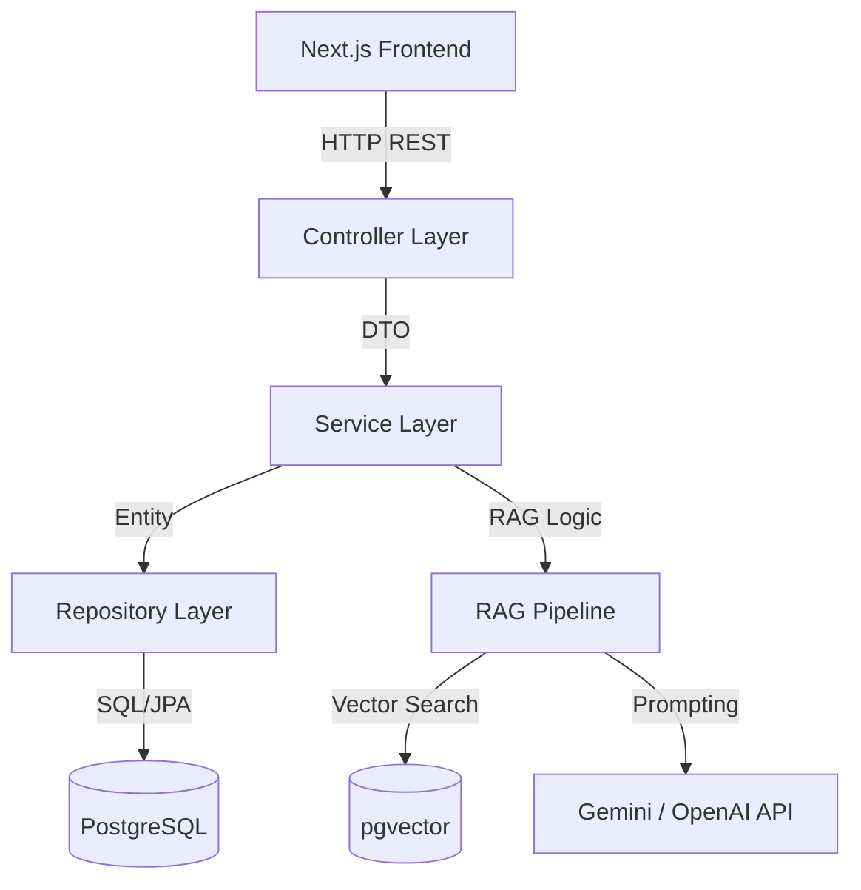
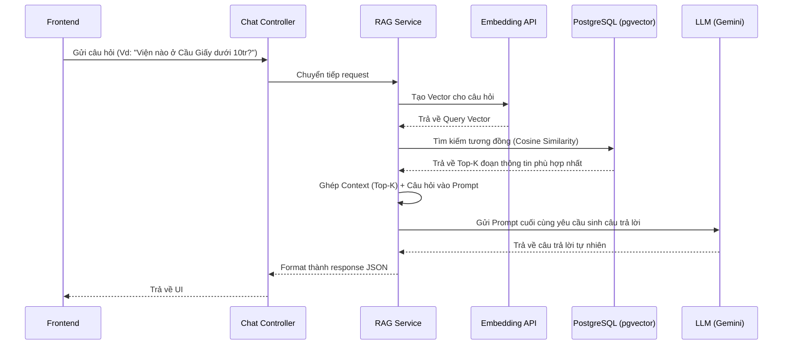
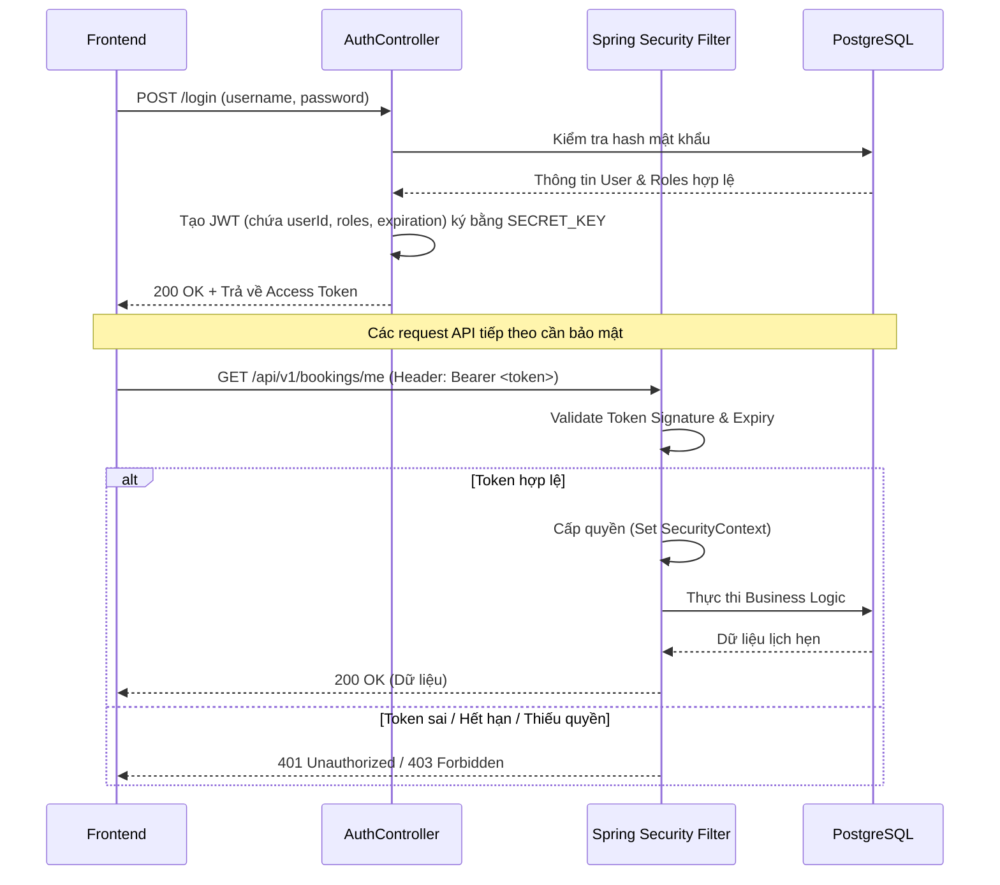

# Kiến trúc hệ thống Backend AnLao.vn

Tài liệu này mô tả chi tiết kiến trúc của Backend Spring Boot cho nền tảng AnLao.vn, bao gồm cấu trúc mã nguồn, luồng xử lý RAG (Retrieval-Augmented Generation), thiết kế API và cơ chế bảo mật.

## 1. Kiến trúc mã nguồn (Source Code Architecture)

Dự án áp dụng mô hình **Layered Architecture (Kiến trúc phân lớp)** kết hợp với một số nguyên tắc của **Domain-Driven Design (DDD)** ở mức cơ bản để đảm bảo tính module hóa, dễ bảo trì và mở rộng.

- **Controller Layer (Giao diện API):** Tiếp nhận HTTP request từ Frontend (Next.js), validate dữ liệu đầu vào cơ bản, gọi logic từ Service Layer và định dạng dữ liệu trả về (DTO).
- **Service Layer (Nghiệp vụ):** Chứa toàn bộ business logic. Chịu trách nhiệm xử lý các quy trình nghiệp vụ phức tạp (như đặt lịch, kiểm tra trống), giao tiếp với Repository và các dịch vụ bên ngoài (như AI LLM).
- **Repository Layer (Truy cập dữ liệu):** Giao tiếp với cơ sở dữ liệu PostgreSQL thông qua Spring Data JPA/Hibernate.
- **Entity / Domain Layer:** Biểu diễn cấu trúc dữ liệu trong CSDL thành các object Java.
- **DTO Layer (Data Transfer Object):** Các object dùng để truyền dữ liệu giữa client và server, giúp tách biệt giao diện API với cấu trúc DB thực tế.
- **Config & Security Layer:** Chứa cấu hình hệ thống, bảo mật (Spring Security), CORS, tích hợp Swagger/OpenAPI.

---

## 2. Luồng RAG (Retrieval-Augmented Generation)

Hệ thống RAG hỗ trợ chatbot tư vấn chọn viện dưỡng lão thông minh. Nó sử dụng dữ liệu thực tế của 14 cơ sở (giá cả, dịch vụ, vị trí...) để sinh ra câu trả lời chính xác, giảm thiểu hiện tượng "ảo giác" (hallucination) của AI.

**Vector Database khuyên dùng:** **pgvector** (Extension của PostgreSQL).
*Lợi ích:* 
- Không cần cài đặt và quản lý thêm hệ thống DB độc lập (như ChromaDB, Pinecone).
- Có thể dùng chung connection pool của Spring Boot.
- Dễ dàng `JOIN` dữ liệu vector với các bảng quan hệ (như bảng `facilities` hoặc `reviews`).

### Luồng 1: Ingestion (Vector hóa dữ liệu)
Được chạy định kỳ hoặc khi admin cập nhật thông tin cơ sở:
1. Đọc dữ liệu dạng văn bản từ DB hoặc tài liệu.
2. Cắt văn bản thành các đoạn nhỏ (**Chunking**).
3. Gọi API Embedding (vd: `text-embedding-004`) để chuyển đổi chunk thành Vector.
4. Lưu Vector vào bảng `facility_chunks` trong PostgreSQL (sử dụng kiểu dữ liệu `vector` của pgvector).

### Luồng 2: Retrieval & Generation (Truy vấn & Phản hồi)
Khi người dùng đặt câu hỏi trên UI:

---

## 3. Thiết kế API (RESTful API)

API được thiết kế chuẩn RESTful, có versioning tại prefix `/api/v1/`. Dữ liệu trao đổi hoàn toàn bằng JSON.

### Các endpoint chính:

#### 1. Người dùng & Xác thực (Auth)
- `POST /api/v1/auth/register` - Đăng ký tài khoản (User).
- `POST /api/v1/auth/login` - Đăng nhập (Kiểm tra credentials, trả về JWT).
- `GET  /api/v1/users/me` - Lấy thông tin profile cá nhân (Yêu cầu Bearer Token).
- `PUT  /api/v1/users/me` - Cập nhật thông tin profile.

#### 2. Cơ sở dưỡng lão (Facilities)
- `GET  /api/v1/facilities` - Danh sách cơ sở (Hỗ trợ phân trang `?page=0&size=10`, lọc theo quận/giá `?district=CauGiay&maxPrice=15000000`).
- `GET  /api/v1/facilities/{id}` - Xem chi tiết một cơ sở.
- `GET  /api/v1/facilities/{id}/reviews` - Xem danh sách đánh giá của cơ sở đó.

#### 3. Đặt lịch (Bookings)
- `POST /api/v1/bookings` - Tạo lịch hẹn tham quan cơ sở.
- `GET  /api/v1/bookings/me` - Danh sách lịch hẹn của User đang đăng nhập.
- `PATCH /api/v1/bookings/{id}/status` - Cập nhật trạng thái lịch hẹn (`PENDING` -> `CONFIRMED` / `CANCELLED`). Yêu cầu quyền thao tác tương ứng.

#### 4. Trợ lý AI (Chat)
- `POST /api/v1/chat` - Nhắn tin với Chatbot RAG. Payload gồm nội dung tin nhắn và lịch sử hội thoại (session id).

---

## 4. Bảo mật và Phân quyền (Security & JWT)

Hệ thống áp dụng cơ chế xác thực **Stateless** sử dụng **JSON Web Token (JWT)** thông qua Spring Security.

### Chi tiết triển khai:
1. **Authentication:** 
   - Mật khẩu lưu trong CSDL được mã hóa một chiều bằng `BCryptPasswordEncoder`.
   - Khi đăng nhập thành công, Server tạo JWT có thời hạn (vd: 24h) chứa Claim là `sub` (email/username) và `roles`.
2. **Authorization (Phân quyền):**
   - Lớp `JwtAuthenticationFilter` (kế thừa `OncePerRequestFilter`) can thiệp vào chuỗi Filter Chain của Spring Security để đọc và xác thực Token trên mỗi request.
   - Các API nhạy cảm được bảo vệ bằng Annotation: 
     - `@PreAuthorize("isAuthenticated()")` cho người dùng thông thường.
     - `@PreAuthorize("hasRole('ADMIN')")` cho các tác vụ quản trị.
3. **CORS:** Cấu hình trong Spring Security để chỉ cho phép các Domain cụ thể (vd: `http://localhost:3000`, `https://anlao.vn`) được phép gọi API.
