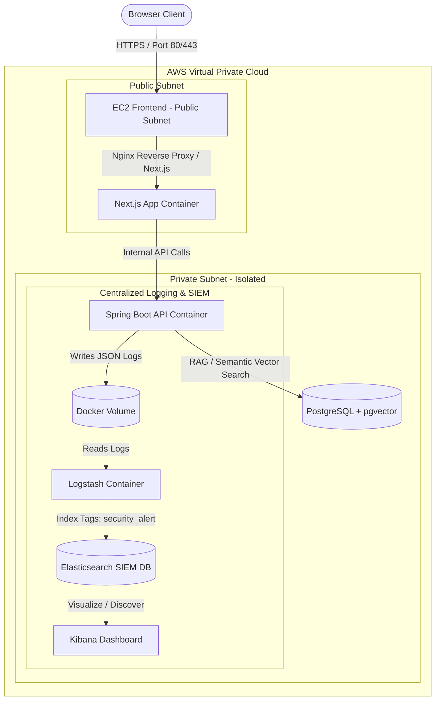

# 🏥 AnLao.vn — AI-Powered Nursing Home Booking & Search Platform

AnLao.vn is a comprehensive, production-ready monorepo combining a modern Next.js 15 frontend, a robust Spring Boot 3 API backend, and an intelligent Retrieval-Augmented Generation (RAG) AI consulting engine. 

Designed for high reliability and security, it includes a centralized logging system (ELK Stack) for SIEM monitoring and fully automated Infrastructure as Code (IaC) configuration using Terraform for secure deployment on AWS.

---

<div align="center">

[](https://nextjs.org/)
[](https://react.dev/)
[](https://spring.io/projects/spring-boot)
[](https://www.postgresql.org/)
[](https://ai.google.dev/)
[](https://www.docker.com/)
[](https://www.terraform.io/)
[](https://www.elastic.co/)

</div>

---

## 📐 System Architecture

The project adopts a modern **Three-Tier Secure Architecture** separated by subnets inside an AWS VPC.



---

## ✨ Core Features

### 1. User & Admin Portal (Next.js 15)
* **Semantic & Filtered Search:** Dynamic client-side SPA filtering with Debounce logic for real-time facility search by pricing, district, care type, and tags without page reloads.
* **Lazy Registration UX:** Allows users to select schedules and book visits using only basic contact info (name and phone). The system automatically registers their account in the background and issues a secure JWT token, dramatically reducing booking abandonment.
* **Admin CMS Dashboard:** Full CRUD management of elderly care facilities (add facilities, upload images, manage prices, and configure amenities tags).

### 2. AI RAG (Retrieval-Augmented Generation) Chatbot
* Toggles semantic search over the facility database by combining PostgreSQL's **pgvector** and Google's **Gemini API** (`gemini-2.5-flash` model and `text-embedding-004`).
* Employs cosine similarity mapping (`<=> < 0.45` threshold) to matches user queries with parsed chunks of facility descriptions.
* Fully automated database vector seeder (`VectorSeeder`) that updates missing embeddings on startup using Gemini.

### 3. DevSecOps & Centralized Logging (ELK Stack)
* **JSON Log Rotation:** Spring Boot utilizes Logback encoder to pipe structured logs (`anlao-api-json.log`) to a shared Docker volume.
* **Security Auditing:** Authentication failures and access control violations are intercepted by `GlobalExceptionHandler` and tagged with `[SECURITY_AUDIT]` detailing the Client IP and Browser User-Agent.
* **Real-time SIEM Pipeline:** Logstash automatically tails log volumes, applies security filters, attaches a `security_alert` tag, and daily indexes them into Elasticsearch. Kibana Discover is configured for real-time threat threat intelligence.

### 4. Infrastructure as Code (Terraform)
* **VPC Isolation:** Provisions public subnets for public-facing servers (Nginx proxy) and isolated private subnets for application servers (backend API, database, and logs).
* **AWS SSM Session Manager:** Restricts EC2 SSH port (22) from being exposed to the Internet. Maintenance and command execution are routed securely via AWS SSM agent.
* **AWS Budgeting Alerts:** Protects cloud billing by configuring budget triggers that email warnings when costs exceed threshold limits ($4/month forecast or $5/month actuals).

---

## 📂 Folder Structure

```text
An-Lao/
├── An-Lao-FE/               # Next.js 15 Standalone Web Application
│   ├── app/                 # App Router (pages, layouts, admin, chat, bookings)
│   ├── components/          # Reusable UI components
│   ├── hooks/               # Custom React hooks (useAuth, useMobile, etc.)
│   └── Dockerfile           # Optimized multi-stage production Alpine build
│
├── An-Lao-BE/               # Spring Boot 3 Backend API Service
│   ├── src/main/java/       # Controller, Service, DTO, Entity, Security, Repository
│   ├── src/main/resources/
│   │   ├── db/migration/    # Flyway database schema & seed scripts
│   │   └── logback-spring.xml # Plain console logs for dev / JSON logs for prod
│   ├── Dockerfile           # Multi-stage Eclipse Temurin JRE 21 build
│   └── pom.xml              # Maven dependencies (Maven compiler, Logstash encoder)
│
├── elk/                     # SIEM Stack configuration files
│   └── logstash/pipeline/   # Logstash pipelines parsing JSON audit logs
│
├── terraform/               # Infrastructure as Code AWS files
│   ├── provider.tf          # Provider setup (default: ap-southeast-1)
│   ├── vpc.tf               # VPC, public/private subnets, NAT Gateway, Routing
│   ├── security_groups.tf   # Firewalls restricting incoming traffic to internal services
│   ├── ec2.tf               # AWS Instances provisioning & automated Docker setup
│   ├── iam.tf               # AWS SSM Integration configurations
│   └── budget.tf            # Billing thresholds alerts setup
│
├── docker-compose.yml       # Monorepo container deployment configurations
└── .env.example             # Template for API credentials and local databases
```

---

## 🚀 Local Development Setup

The fastest and most stable way to run the entire stack (FE, BE, Database, SIEM) is using **Docker Compose**.

### Prerequisite:
* Install **Docker Desktop** on your machine.
* Obtain a **Gemini API Key** from [Google AI Studio](https://aistudio.google.com/).

### 1. Configure Environment Variables
Create a `.env` file in the root directory:
```env
# Gemini API credentials
GEMINI_API_KEY=AIzaSyYourGeminiAPIKeyHere
```

### 2. Startup Containers
Run the following command at the root of the project:
```bash
docker compose up --build -d
```
Docker will automatically build frontend/backend images and start all 6 services:
* **Frontend Web Portal:** `http://localhost:3000`
* **Swagger API Documentation:** `http://localhost:8080/swagger-ui/index.html`
* **Kibana SIEM Dashboard:** `http://localhost:5601`
* **Elasticsearch Engine:** `http://localhost:9200`
* **PostgreSQL (pgvector):** Listening on host port `5434` (mapped to `5432` in container)

### 3. Verify Logging Pipeline
1. Access `http://localhost:3000/login`.
2. Input a random email and invalid password, then attempt to log in **5 times**.
3. Access Kibana at `http://localhost:5601`.
4. Go to **Analytics** -> **Discover** -> Create a Data View matching `anlao-logs-*` with `@timestamp`.
5. Search for `tags : "security_alert"`. You will see all 5 failed login attempts flagged with your Client IP and User Agent.

---

## ☁️ AWS Cloud Deployment (Terraform)

Deploying to AWS is fully automated. The infrastructure matches the design defined in [VPC Network Architecture](#-system-architecture).

### 1. Prerequisites
* Install **Terraform CLI** and **AWS CLI**.
* Configure your AWS CLI credentials:
  ```bash
  aws configure
  ```

### 2. Launch Infrastructure
Navigate to the `terraform/` directory:
```bash
cd terraform
terraform init
terraform plan
terraform apply
```

*Terraform will output the public IP of the Frontend EC2 instance and SSM command IDs to securely connect to private instances.*

### 3. Cleaning Up (Avoid Charges)
Once you have completed testing or showing the project to recruiters, terminate all AWS resources to avoid billing charges:
```bash
terraform destroy
```

---

## 🛠️ Monorepo Contribution Rules

1. **Security Standards:** Never commit secrets, API Keys, or credentials. Always use environment variable interpolation (`${GEMINI_API_KEY}`) and keep local parameters in the git-ignored `.env` file.
2. **Flyway Migrations:** All schema changes must be declared via Flyway migrations (`db/migration/V1__...`, `V2__...`, `V3__...`) to maintain consistent database state between Docker and AWS.
3. **TypeScript Quality:** Avoid using `any` types. Define interfaces or types for all request/response objects.

---

<div align="center">

**AnLao.vn** — Caring for elderly loved ones with modern AI & Cloud solutions 💚

</div>
